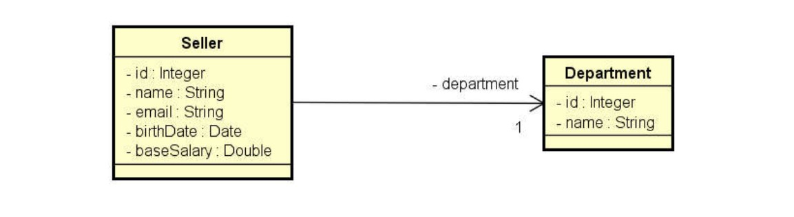

# Project-DAO-JDBC

Projeto de aprendizagem mostrando a conexão da aplicação Java com banco de dados MySQL utilizando o padrão de DAO.

Curso **********Udemy**********

Professor **********************Nelio Alves**********************

---

# Base de dados usado no projeto

Criação do banco

```sql
CREATE TABLE department (
  Id int(11) NOT NULL AUTO_INCREMENT,
  Name varchar(60) DEFAULT NULL,
  PRIMARY KEY (Id)
);

CREATE TABLE seller (
  Id int(11) NOT NULL AUTO_INCREMENT,
  Name varchar(60) NOT NULL,
  Email varchar(100) NOT NULL,
  BirthDate datetime NOT NULL,
  BaseSalary double NOT NULL,
  DepartmentId int(11) NOT NULL,
  PRIMARY KEY (Id),
  FOREIGN KEY (DepartmentId) REFERENCES department (id)
);

INSERT INTO department (Name) VALUES 
  ('Computers'),
  ('Electronics'),
  ('Fashion'),
  ('Books');

INSERT INTO seller (Name, Email, BirthDate, BaseSalary, DepartmentId) VALUES 
  ('Bob Brown','bob@gmail.com','1998-04-21 00:00:00',1000,1),
  ('Maria Green','maria@gmail.com','1979-12-31 00:00:00',3500,2),
  ('Alex Grey','alex@gmail.com','1988-01-15 00:00:00',2200,1),
  ('Martha Red','martha@gmail.com','1993-11-30 00:00:00',3000,4),
  ('Donald Blue','donald@gmail.com','2000-01-09 00:00:00',4000,3),
  ('Alex Pink','bob@gmail.com','1997-03-04 00:00:00',3000,2);
```

# Modelo de Relacional


# Entidades usadas



Ambas as entidades possuem as seguintes implementações:

- Constructors
- Getters/Setters
- HashCode/Equals
- toString
- Implementar a interface Serializable

# Implementações JDBC

O projeto se resume a implementação do algoritmo de conexão com o banco de dados nas entidades DaoJDBC.

As entidades *************SellerDaoJDBC************* e *****************DepartmentDaoJDBC***************** possuem as implementações:

- findById
- findByDepartment → somente em *************SellerDaoJDBC*************
- findAll
- insert
- update
- delete